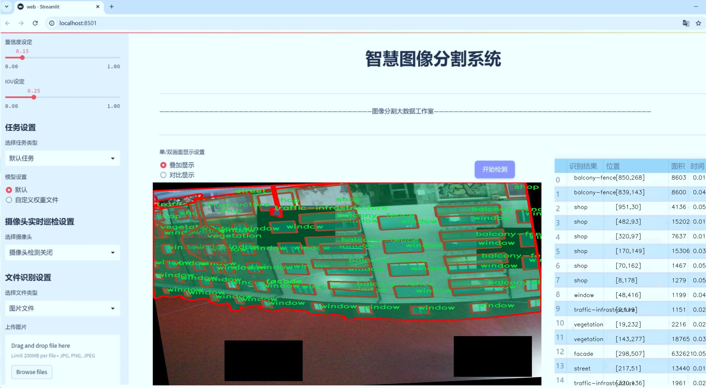
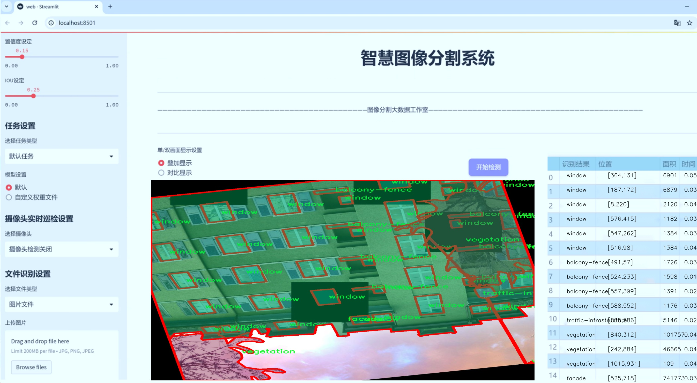
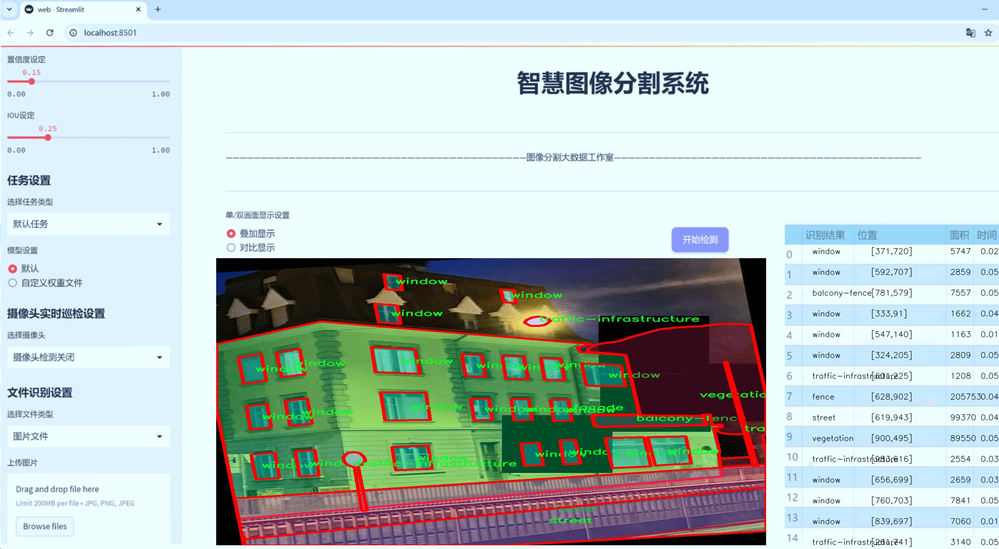
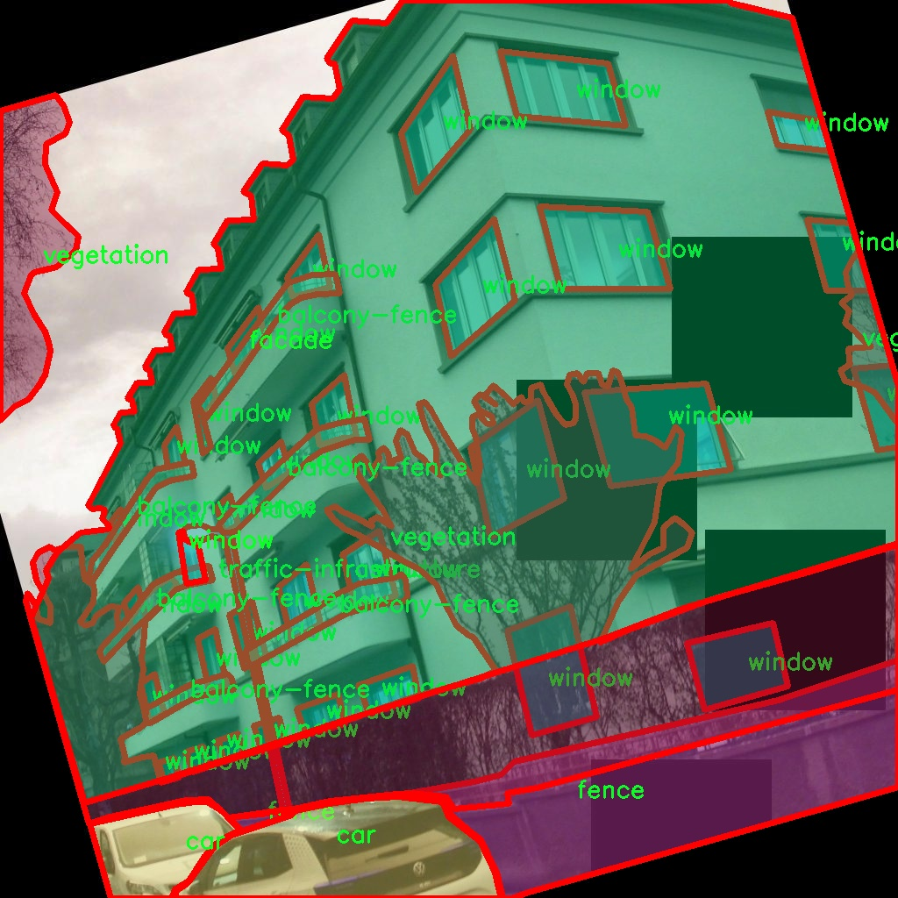
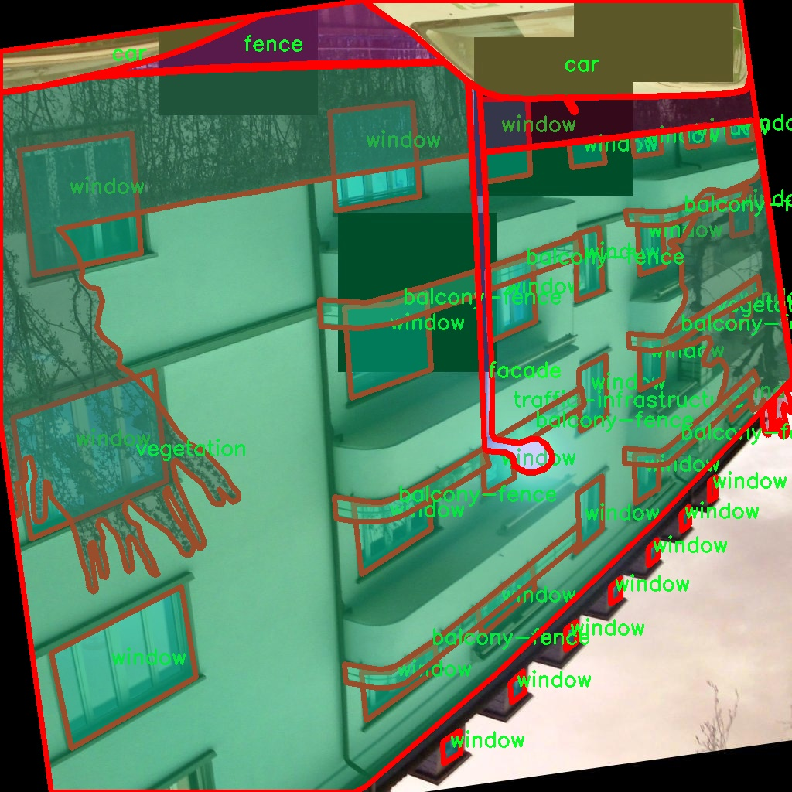
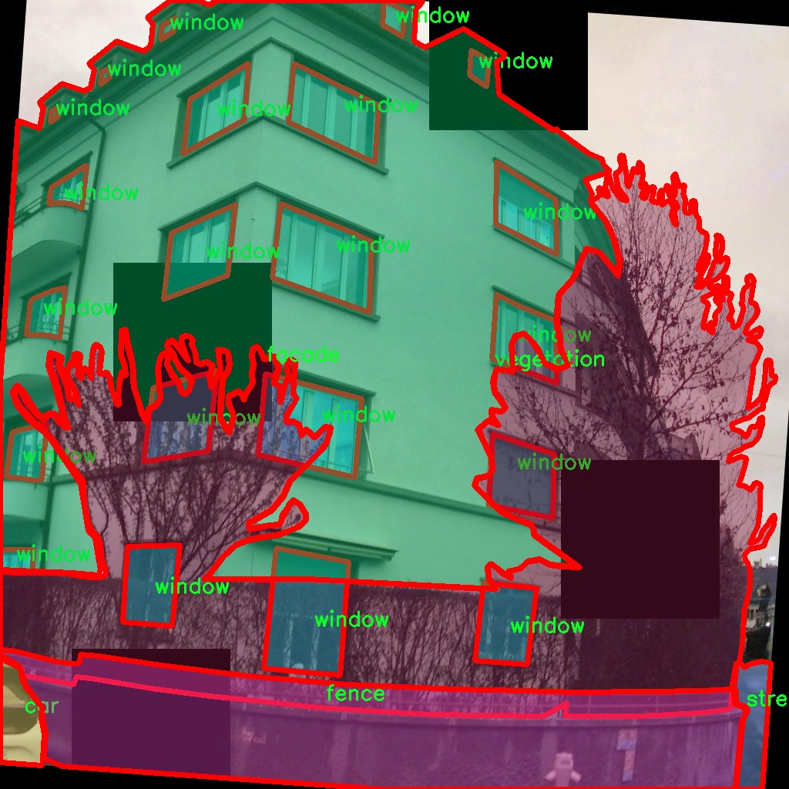
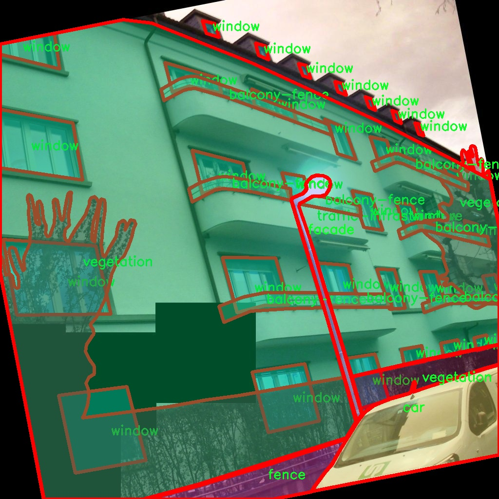
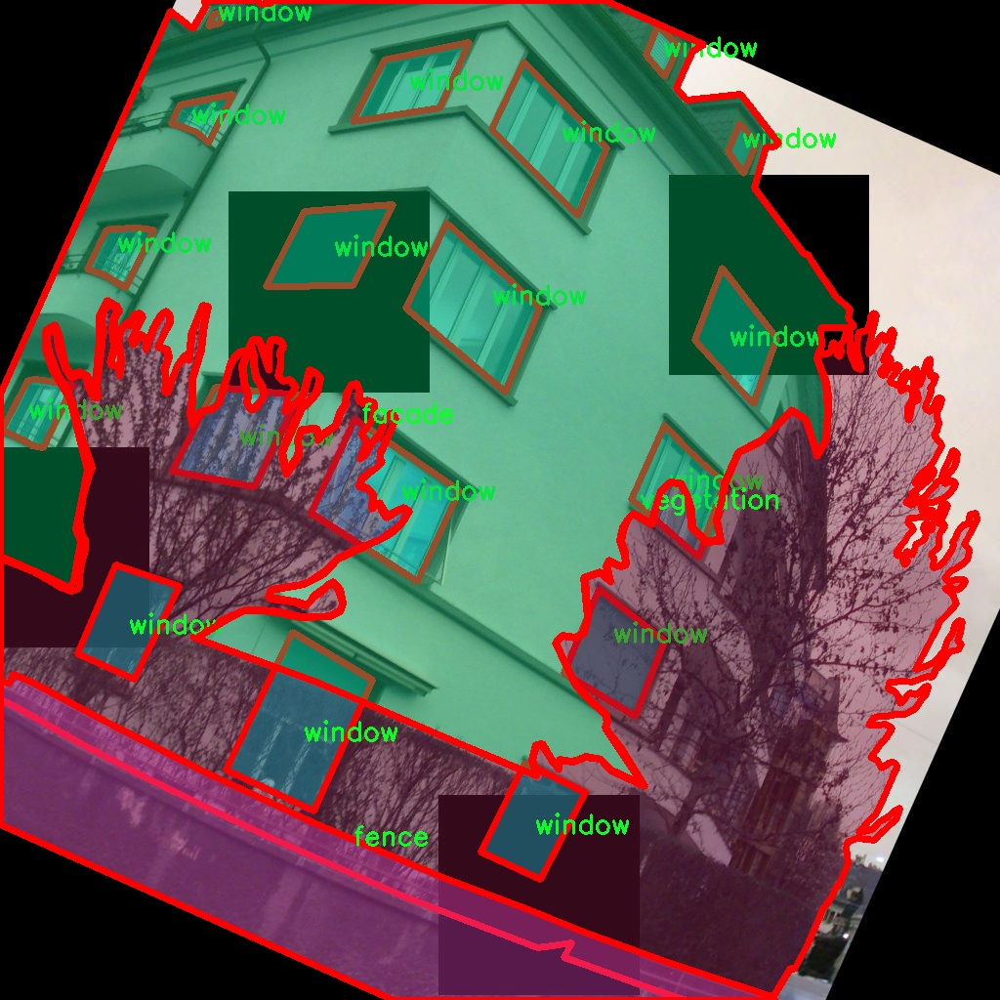

# 建筑立面图像分割系统： yolov8-seg-KernelWarehouse

### 1.研究背景与意义

[参考博客](https://gitee.com/YOLOv8_YOLOv11_Segmentation_Studio/projects)

[博客来源](https://kdocs.cn/l/cszuIiCKVNis)

研究背景与意义

随着城市化进程的加快，建筑立面的设计与维护在城市规划和管理中愈发重要。建筑立面不仅是建筑物的外观，更是城市文化、历史和艺术的体现。对建筑立面的有效分析与管理，不仅能够提升城市的美观度，还能促进可持续发展和资源的合理利用。在这一背景下，图像分割技术作为计算机视觉领域的重要研究方向，逐渐成为建筑立面分析的重要工具。特别是基于深度学习的图像分割方法，因其在特征提取和模式识别方面的优势，已被广泛应用于建筑立面图像的处理与分析。

YOLO（You Only Look Once）系列模型以其高效的实时目标检测能力而闻名。YOLOv8作为该系列的最新版本，结合了更先进的网络结构和算法优化，具备了更强的特征提取能力和更快的处理速度。然而，尽管YOLOv8在目标检测方面表现出色，但在建筑立面图像的细粒度分割任务中仍存在一定的局限性。为了克服这些不足，基于改进YOLOv8的建筑立面图像分割系统的研究应运而生。

本研究所使用的数据集包含1400幅建筑立面图像，涵盖了10个不同的类别，包括阳台围栏、汽车、立面、围栏、非建筑基础设施、商店、街道、交通基础设施、植被和窗户。这些类别的多样性为模型的训练和测试提供了丰富的样本，能够有效提高模型的泛化能力和准确性。通过对这些类别的细致划分，研究者能够更好地理解建筑立面的构成要素及其在城市环境中的作用。

改进YOLOv8的建筑立面图像分割系统不仅有助于提升建筑立面分析的精度，还能为城市规划和管理提供科学依据。通过对建筑立面进行精确的分割与识别，相关部门可以更好地进行城市资源的配置与管理。例如，在城市绿化规划中，能够通过对植被的准确识别与分割，制定出更为合理的绿化方案；在建筑维护中，能够及时发现并处理立面损坏的问题，从而延长建筑物的使用寿命。

此外，本研究还具有重要的社会意义。随着人们对生活环境质量要求的提高，建筑立面的美观与功能性愈发受到重视。通过构建高效的建筑立面图像分割系统，能够为建筑设计师、城市规划者及相关从业人员提供有力的技术支持，推动建筑行业的创新与发展。同时，该系统的研究成果也有望为其他领域的图像分割任务提供借鉴，推动计算机视觉技术的进一步发展。

综上所述，基于改进YOLOv8的建筑立面图像分割系统的研究，不仅在技术层面上具有重要的学术价值，更在实际应用中展现出广泛的社会意义。通过该研究，期望能够为建筑立面的分析与管理提供新的思路和方法，推动城市可持续发展和环境保护的进程。

### 2.图片演示







注意：本项目提供完整的训练源码数据集和训练教程,由于此博客编辑较早,暂不提供权重文件（best.pt）,需要按照6.训练教程进行训练后实现上图效果。

### 3.视频演示

[3.1 视频演示](https://www.bilibili.com/video/BV1vYUUYxEKz/)

### 4.数据集信息

##### 4.1 数据集类别数＆类别名

nc: 10
names: ['balcony-fence', 'car', 'facade', 'fence', 'non-building-infrastructure', 'shop', 'street', 'traffic-infrastructure', 'vegetation', 'window']


##### 4.2 数据集信息简介

数据集信息展示

在现代建筑立面图像分割的研究中，数据集的构建与选择至关重要。为此，我们使用了名为“building-facade-segmentation-augmentation”的数据集，旨在训练和改进YOLOv8-seg模型，以实现高效的建筑立面图像分割。该数据集的设计充分考虑了建筑环境的复杂性和多样性，包含了10个类别，分别为阳台围栏、汽车、建筑立面、围栏、非建筑基础设施、商店、街道、交通基础设施、植被和窗户。这些类别不仅涵盖了建筑立面中常见的元素，还包括了周边环境的特征，使得模型在实际应用中能够更好地理解和处理复杂的场景。

数据集中的每个类别都经过精心标注，确保了分割任务的准确性和有效性。例如，阳台围栏和窗户的标注细致入微，能够帮助模型学习到这些结构的形状和位置特征。汽车、商店和街道等类别则提供了丰富的上下文信息，使得模型在处理建筑立面时能够更好地理解周围环境的关系。非建筑基础设施和交通基础设施的加入，进一步增强了数据集的多样性，使得模型在面对不同场景时能够具备更强的适应能力。

为了提升模型的泛化能力，数据集还进行了多种数据增强处理。这些增强技术包括旋转、缩放、裁剪、颜色变换等，旨在模拟不同的拍摄条件和环境变化。通过这些技术，数据集不仅增加了样本的数量，还提高了样本的多样性，使得模型在训练过程中能够学习到更为丰富的特征。这种多样化的训练方式对于提升模型在实际应用中的表现至关重要，尤其是在面对复杂的城市环境时。

此外，数据集的构建也考虑到了实际应用中的挑战。例如，在城市环境中，建筑立面往往与周围的交通基础设施和植被相互交织，这就要求模型能够有效地区分不同类别之间的边界。通过引入如围栏、街道和植被等类别，数据集使得模型在分割任务中能够更好地应对这些挑战，从而提升了建筑立面分割的精度和可靠性。

总之，“building-facade-segmentation-augmentation”数据集为改进YOLOv8-seg模型提供了一个丰富而多样的训练基础。通过精确的标注和有效的数据增强策略，该数据集不仅能够提升模型的分割性能，还能增强其在复杂场景中的适应能力。这对于推动建筑立面图像分割技术的发展具有重要意义，预示着在智能城市建设和建筑监测等领域的广泛应用前景。随着数据集的不断优化和扩展，我们期待未来能够实现更高效、更准确的建筑立面图像分割系统，为相关研究和应用提供强有力的支持。











### 5.项目依赖环境部署教程（零基础手把手教学）

[5.1 环境部署教程链接（零基础手把手教学）](https://www.bilibili.com/video/BV1jG4Ve4E9t/?vd_source=bc9aec86d164b67a7004b996143742dc)


[5.2 安装Python虚拟环境创建和依赖库安装视频教程链接（零基础手把手教学）](https://www.bilibili.com/video/BV1nA4VeYEze/?vd_source=bc9aec86d164b67a7004b996143742dc)

### 6.手把手YOLOV8-seg训练视频教程（零基础手把手教学）

[6.1 手把手YOLOV8-seg训练视频教程（零基础小白有手就能学会）](https://www.bilibili.com/video/BV1cA4VeYETe/?vd_source=bc9aec86d164b67a7004b996143742dc)


按照上面的训练视频教程链接加载项目提供的数据集，运行train.py即可开始训练



     Epoch   gpu_mem       box       obj       cls    labels  img_size
     1/200     0G   0.01576   0.01955  0.007536        22      1280: 100%|██████████| 849/849 [14:42<00:00,  1.04s/it]
               Class     Images     Labels          P          R     mAP@.5 mAP@.5:.95: 100%|██████████| 213/213 [01:14<00:00,  2.87it/s]
                 all       3395      17314      0.994      0.957      0.0957      0.0843

     Epoch   gpu_mem       box       obj       cls    labels  img_size
     2/200     0G   0.01578   0.01923  0.007006        22      1280: 100%|██████████| 849/849 [14:44<00:00,  1.04s/it]
               Class     Images     Labels          P          R     mAP@.5 mAP@.5:.95: 100%|██████████| 213/213 [01:12<00:00,  2.95it/s]
                 all       3395      17314      0.996      0.956      0.0957      0.0845

     Epoch   gpu_mem       box       obj       cls    labels  img_size
     3/200     0G   0.01561    0.0191  0.006895        27      1280: 100%|██████████| 849/849 [10:56<00:00,  1.29it/s]
               Class     Images     Labels          P          R     mAP@.5 mAP@.5:.95: 100%|███████   | 187/213 [00:52<00:00,  4.04it/s]
                 all       3395      17314      0.996      0.957      0.0957      0.0845


### 7.50+种全套YOLOV8-seg创新点加载调参实验视频教程（一键加载写好的改进模型的配置文件）

[7.1 50+种全套YOLOV8-seg创新点加载调参实验视频教程（一键加载写好的改进模型的配置文件）](https://www.bilibili.com/video/BV1Hw4VePEXv/?vd_source=bc9aec86d164b67a7004b996143742dc)

### YOLOV8-seg算法简介

原始YOLOv8-seg算法原理

YOLOv8-seg算法是YOLO系列中的一项重要进展，旨在将目标检测与语义分割相结合，以实现更为精细的图像理解。该算法在YOLOv8的基础上进行了多项创新，充分利用了深度学习技术的优势，特别是在特征提取和信息融合方面，展现出其独特的优势。

首先，YOLOv8-seg算法的主干网络采用了跨级结构（Cross Stage Partial, CSP）的设计理念，旨在通过优化信息流动来提升模型的性能。在这一结构中，YOLOv8-seg引入了C2f模块，这一模块在YOLOv7的ELAN思想的基础上进行了改进，增加了跳层连接的数量，从而增强了梯度流动，提升了特征提取的效率。这种设计不仅提高了模型的学习能力，同时也保证了其轻量化特性，使得YOLOv8-seg能够在保持高效性的同时，处理更复杂的图像数据。

在特征提取过程中，YOLOv8-seg算法保留了空间金字塔池化（SPPF）模块，利用其多尺度特征融合的能力来增强模型对不同尺寸目标的检测能力。与此同时，YOLOv8-seg在网络的颈部部分，采用了更为简化的结构，删除了多余的卷积层，以减少计算复杂度并提高推理速度。这种设计使得YOLOv8-seg在处理实时视频流时，能够保持较高的帧率，满足实际应用的需求。

YOLOv8-seg算法的另一个显著特点是其创新的损失计算策略。该算法引入了变焦损失（Zoom Loss）来计算分类损失，同时采用数据平均保真度损失和完美交并比损失来优化边界框的回归损失。这种新的损失策略使得模型在进行目标检测时，能够更加准确地定位目标，并有效减少误检和漏检现象。此外，YOLOv8-seg在处理分割任务时，利用了全卷积网络（FCN）的思想，通过对特征图的逐像素分类，实现了对目标的精确分割。这一过程不仅提高了分割的精度，也增强了模型对复杂背景的适应能力。

在样本匹配方面，YOLOv8-seg采用了任务对齐学习（Task Alignment Learning, TAL）的方法，通过对分类分数和IOU的高次幂乘积进行加权，来优化正负样本的匹配。这一策略使得模型在进行目标检测和分割时，能够更好地平衡分类和定位的损失，从而提高整体性能。

值得注意的是，YOLOv8-seg在输入数据的处理上也进行了优化。算法在训练过程中，停止使用Mosaic数据增强的策略，以避免对数据真实分布的干扰，从而提高模型的泛化能力。这一改进使得YOLOv8-seg在处理实际应用中的数据时，能够更好地适应多样化的场景，提升了模型的鲁棒性。

在输出端，YOLOv8-seg采用了解耦头的设计，分别处理分类和回归任务。这种设计不仅提高了模型的收敛速度，还增强了对目标的识别能力。通过将分类和定位任务分开处理，YOLOv8-seg能够更精准地捕捉到目标的特征，进而提高检测和分割的精度。

综上所述，YOLOv8-seg算法通过对YOLOv8的多项改进，结合深度学习领域的最新研究成果，展现出其在目标检测与语义分割任务中的强大能力。其轻量化的特征提取网络、创新的损失计算策略、优化的样本匹配方法以及高效的输入处理机制，使得YOLOv8-seg在实时性和准确性之间达到了良好的平衡。这些特性使得YOLOv8-seg不仅适用于学术研究，也在实际应用中展现出广泛的应用前景，尤其是在需要快速、准确处理图像数据的场景中，具有显著的优势。通过进一步的研究与优化，YOLOv8-seg有望在目标检测与分割领域取得更大的突破，推动相关技术的发展与应用。


### 9.系统功能展示（检测对象为举例，实际内容以本项目数据集为准）

图9.1.系统支持检测结果表格显示

  图9.2.系统支持置信度和IOU阈值手动调节

  图9.3.系统支持自定义加载权重文件best.pt(需要你通过步骤5中训练获得)

  图9.4.系统支持摄像头实时识别

  图9.5.系统支持图片识别

  图9.6.系统支持视频识别

  图9.7.系统支持识别结果文件自动保存

  图9.8.系统支持Excel导出检测结果数据


### 10.50+种全套YOLOV8-seg创新点原理讲解（非科班也可以轻松写刊发刊，V11版本正在科研待更新）

#### 10.1 由于篇幅限制，每个创新点的具体原理讲解就不一一展开，具体见下列网址中的创新点对应子项目的技术原理博客网址【Blog】：


[10.1 50+种全套YOLOV8-seg创新点原理讲解链接](https://gitee.com/qunmasj/good)

#### 10.2 部分改进模块原理讲解(完整的改进原理见上图和技术博客链接)【如果此小节的图加载失败可以通过CSDN或者Github搜索该博客的标题访问原始博客，原始博客图片显示正常】

### YOLOv8简介
继YOLOv5之后,Ultralytics公司在2023年1月发布了YOLOv8,该版本可以用于执行目标检测、实例分割和图像分类任务。整个网络结构由4部分组成:输入图像, Backbone主干网络获得图像的特征图, Head检测头预测目标对象和位置, Neck融合不同层的特征并将图像特征传递到预测层。
1)相比于YOLOv5和 YOLOv7算法,YOLOv8在训练时间和检测精度上得到极大提升,而且模型的权重文件只有6 MB,可以部署到任一嵌入式设备中,它凭借自身快速、高效的性能可以很好地满足实时检测的需求。
2)由于YOLOv8算法是YOLOv5的继承版本，对应提供了N、S、 M、L、X 等不同尺度的模型,用于满足不同场景的需求,在精度得到大幅提升的同时,能流畅地训练,并且能安装在各种硬件平台上运行。
3)在输入端,YOLOv8算法使用了Mosaic数据增强[15]、自适应锚框计算[16]等方法。Mosaic数据增强是通过随机缩放、随机裁剪、随机排布的方式进行拼接,丰富检测数据集。自适应锚框计算是网络在初始锚框的基础上输出预测框,通过差值计算、反向更新等操作计算出最佳锚框值。
4)在输出端,YOLOv8算法使用解耦头替换了以往的耦合头,将分类和回归解耦为两个独立的分支,通过解耦使各个任务更加专注,从而解决复杂场景下定位不准及分类错误的问题。


### OREPA：在线卷积重参数化
卷积神经网络(CNNs)已经在许多计算机视觉任务的应用成功，包括图像分类、目标检测、语义分割等。精度和模型效率之间的权衡也已被广泛讨论。

一般来说，一个精度较高的模型通常需要一个更复杂的块，一个更宽或更深的结构。然而，这样的模型总是太重，无法部署，特别是在硬件性能有限、需要实时推理的场景下。考虑到效率，更小、更紧凑和更快的模型自然是首选。

为了获得一个部署友好且高精度的模型，有研究者提出了基于结构重参数化的方法来释放性能。在这些方法中，模型在训练阶段和推理阶段有不同的结构。具体来说，使用复杂的训练阶段拓扑，即重参数化的块，来提高性能。训练结束后，通过等效变换将一个复杂的块重参为成一个单一的线性层。重参后的模型通常具有一个整洁架构模型，例如，通常是一个类似VGG的或一个类似ResNet的结构。从这个角度来看，重参化策略可以在不引入额外的推理时间成本的情况下提高模型的性能。


BN层是重构模型的关键组成部分。在一个重新解析块(图1(b))中，在每个卷积层之后立即添加一个BN层。可以观察到，去除这些BN层会导致的性能退化。然而，当考虑到效率时，这种BN层的使用出乎意料地在训练阶段带来了巨大的计算开销。在推理阶段，复杂的块可以被压缩成一个卷积层。但是，在训练过程中，BN层是非线性的，也就是说，它们将特征映射除以它的标准差，这就阻止了合并整个块。因此，存在大量的中间计算操作(large FLOPS)和缓冲特征映射(high memory usage)。更糟糕的是，这么高的训练预算使得很难探索更复杂和可能更强的重参块。很自然地，下面的问题就出现了：

为什么标准化在重参中这么重要？

通过分析和实验，作者认为BN层中的尺度因子最重要，因为它们能够使不同分支的优化方向多样化。

基于观察结果，作者提出了在线重参化(OREPA)(图1(c))，这是一个两阶段的pipeline，使之能够简化复杂的training-time re-param block。

在第一阶段，block linearization，去除所有的非线性BN层，并引入线性缩放层。这些层与BN层具有相似的性质，因此它们使不同分支的优化多样化。此外，这些层都是线性的，可以在训练过程中合并成卷积层。

第二阶段，block squeezing，将复杂的线性块简化为单一的卷积层。OREPA通过减少由中间计算层引起的计算和存储开销，显著降低了训练成本，对性能只有非常小的影响。

此外，高效化使得探索更复杂的重参化拓扑成为可能。为了验证这一点，作者进一步提出了几个重参化的组件，以获得更好的性能。

在ImageNet分类任务上评估了所提出的OREPA。与最先进的修复模型相比，OREPA将额外的训练时间GPU内存成本降低了65%到75%，并将训练过程加快了1.5-2.3倍。同时，OREPA-ResNet和OREPA-VGG的性能始终优于+0.2%∼+0.6%之前的DBB和RepVGG方法。同时作者还评估了在下游任务上的OREPA，即目标检测和语义分割。作者发现OREPA可以在这些任务上也可以带来性能的提高。

提出了在线卷积重参化(OREPA)策略，这极大地提高了重参化模型的训练效率，并使探索更强的重参化块成为可能；

通过对重参化模型工作机制的分析，用引入的线性尺度层代替BN层，这仍然提供了不同的优化方向，并保持了表示能力;

在各种视觉任务上的实验表明，OREPA在准确性和训练效率方面都优于以前的重参化模型(DBB/RepVGG)。


#### 结构重参化
结构重参化最近被重视并应用于许多计算机视觉任务，如紧凑模型设计、架构搜索和剪枝。重参化意味着不同的架构可以通过参数的等价转换来相互转换。例如，1×1卷积的一个分支和3×3卷积的一个分支，可以转移到3×3卷积的单个分支中。在训练阶段，设计了多分支和多层拓扑来取代普通的线性层(如conv或全连接层)来增强模型。Cao等讨论了如何在训练过程中合并深度可分离卷积核。然后在推理过程中，将训练时间的复杂模型转移到简单模型中，以便于更快的推理。

在受益于复杂的training-time拓扑，同时，当前的重参化方法训练使用不可忽略的额外计算成本。当块变得更复杂以变得更强的表示时，GPU内存利用率和训练时间将会越来越长，最终走向不可接受。与以往的重参化方法不同，本文更多地关注训练成本。提出了一种通用的在线卷积重参化策略，使training-time的结构重参化成为可能。


#### Normalization
BN被提出来缓解训练非常深度神经网络时的梯度消失问题。人们认为BN层是非常重要的，因为它们平滑了损失。最近关于无BN神经网络的研究声称，BN层并不是不可或缺的。通过良好的初始化和适当的正则化，可以优雅地去除BN层。

对于重参化模型，作者认为重参化块中的BN层是关键的。无BN的变体将会出现性能下降。然而，BN层是非线性的，也就是说，它们将特征图除以它的标准差，这阻止了在线合并块。为了使在线重参化可行，作者去掉了重参块中的所有BN层，并引入了BN层的线性替代方法，即线性缩放层。

#### 卷积分解
标准卷积层计算比较密集，导致大的FLOPs和参数量。因此，卷积分解方法被提出，并广泛应用于移动设备的轻量化模型中。重参化方法也可以看作是卷积分解的某种形式，但它更倾向于更复杂的拓扑结构。本文的方法的不同之处在于，在kernel-level上分解卷积，而不是在structure level。

#### 在线重参化
在本节中，首先，分析了关键组件，即重参化模型中的BN层，在此基础上提出了在线重参化(OREPA)，旨在大大减少再参数化模型的训练时间预算。OREPA能够将复杂的训练时间块简化为一个卷积层，并保持了较高的精度。

OREPA的整体pipeline如图所示，它包括一个Block Linearization阶段和一个Block Squeezing阶段。


参考该博客通过分析多层和多分支结构的优化多样性，深入研究了重参化的有效性，并证明了所提出的线性缩放层和BN层具有相似的效果。

最后，随着训练预算的减少，进一步探索了更多的组件，以实现更强的重参化模型，成本略有增加。

#### 重参化中的Normalization
作者认为中间BN层是重参化过程中多层和多分支结构的关键组成部分。以SoTA模型DBB和RepVGG为例，去除这些层会导致严重的性能下降，如表1所示。


这种观察结果也得到了Ding等人的实验支持。因此，作者认为中间的BN层对于重参化模型的性能是必不可少的。

然而，中间BN层的使用带来了更高的训练预算。作者注意到，在推理阶段，重参化块中的所有中间操作都是线性的，因此可以合并成一个卷积层，从而形成一个简单的结构。

但在训练过程中，BN层是非线性的，即它们将特征映射除以其标准差。因此，中间操作应该单独计算，这将导致更高的计算和内存成本。更糟糕的是，如此高的成本将阻止探索更强大的训练模块。

#### Block Linearization
如3.1中所述，中间的BN层阻止了在训练过程中合并单独的层。然而，由于性能问题，直接删除它们并不简单。为了解决这一困境，作者引入了channel级线性尺度操作作为BN的线性替代方法。

缩放层包含一个可学习的向量，它在通道维度中缩放特征映射。线性缩放层具有与BN层相似的效果，它们都促进多分支向不同的方向进行优化，这是重参化时性能提高的关键。除了对性能的影响外，线性缩放层还可以在训练过程中进行合并，使在线重参化成为可能。


基于线性缩放层，作者修改了重参化块，如图所示。具体来说，块的线性化阶段由以下3个步骤组成：

首先，删除了所有的非线性层，即重参化块中的BN层

其次，为了保持优化的多样性，在每个分支的末尾添加了一个缩放层，这是BN的线性替代方法

最后，为了稳定训练过程，在所有分支的添加后添加一个BN层。

一旦完成线性化阶段，在重参化块中只存在线性层，这意味着可以在训练阶段合并块中的所有组件。

#### Block Squeezing
Block Squeezing步骤将计算和内存昂贵的中间特征映射上的操作转换为更经济的kernel上的操作。这意味着在计算和内存方面从减少到，其中、是特征图和卷积核的空间尺寸。

一般来说，无论线性重参化块是多么复杂，以下2个属性始终成立：

Block中的所有线性层，例如深度卷积、平均池化和所提出的线性缩放，都可以用带有相应参数的退化卷积层来表示;

Block可以由一系列并行分支表示，每个分支由一系列卷积层组成。

有了上述两个特性，如果可以将

多层（即顺序结构）

多分支（即并行结构）

简化为单一卷积，就可以压缩一个块。在下面的部分中，将展示如何简化顺序结构(图(a))和并行结构(图(b))。


### 11.项目核心源码讲解（再也不用担心看不懂代码逻辑）

#### 11.1 ultralytics\models\sam\__init__.py

以下是对给定代码的核心部分进行提炼和详细注释的结果：

```python
# Ultralytics YOLO 🚀, AGPL-3.0 license

# 从当前包中导入SAM模型和Predictor预测器
from .model import SAM
from .predict import Predictor

# 定义模块的公开接口，包含SAM和Predictor
__all__ = 'SAM', 'Predictor'  # 这表示当使用`from module import *`时，只会导入SAM和Predictor
```

### 代码分析与注释：

1. **导入模块**：
   - `from .model import SAM`：从当前包的`model`模块中导入`SAM`类或函数。`SAM`可能是一个与YOLO相关的模型，用于目标检测或其他计算机视觉任务。
   - `from .predict import Predictor`：从当前包的`predict`模块中导入`Predictor`类或函数。`Predictor`通常用于执行模型的预测功能。

2. **定义公开接口**：
   - `__all__ = 'SAM', 'Predictor'`：这是一个特殊的变量，用于定义当使用`from module import *`语句时，哪些名称会被导入。这里定义了`SAM`和`Predictor`为模块的公开接口，意味着这两个类或函数是模块的主要功能部分，用户可以直接使用它们。

通过以上分析，可以看出这段代码的主要功能是设置模块的结构，使得用户能够方便地访问核心功能（`SAM`和`Predictor`），同时保持模块的封装性。

这个文件是一个Python模块的初始化文件，位于`ultralytics/models/sam/`目录下。它的主要作用是定义该模块的公共接口，方便其他模块或文件导入使用。

首先，文件顶部的注释部分提到这是与Ultralytics YOLO相关的代码，并且遵循AGPL-3.0许可证。这表明该项目是开源的，用户在使用和修改代码时需要遵循该许可证的条款。

接下来，文件通过相对导入的方式引入了两个类：`SAM`和`Predictor`。这两个类分别来自于同一目录下的`model`和`predict`模块。`SAM`可能是一个模型类，负责定义和处理与特定模型相关的功能，而`Predictor`则可能是一个用于进行预测的类，提供模型推理的功能。

最后，`__all__`变量被定义为一个元组，包含了`'SAM'`和`'Predictor'`。这个变量的作用是指定当使用`from module import *`语句时，哪些名称会被导入。通过这种方式，模块的使用者可以清楚地知道可以使用哪些公共接口，从而避免直接访问模块内部的私有实现。

总的来说，这个文件简洁明了，主要功能是组织和暴露模块的公共类，便于其他部分的代码进行调用和使用。

#### 11.2 ultralytics\models\fastsam\val.py

```python
# 导入必要的模块
from ultralytics.models.yolo.segment import SegmentationValidator
from ultralytics.utils.metrics import SegmentMetrics

class FastSAMValidator(SegmentationValidator):
    """
    自定义验证类，用于在Ultralytics YOLO框架中进行快速SAM（Segment Anything Model）分割。

    该类扩展了SegmentationValidator类，专门定制了快速SAM的验证过程。它将任务设置为'segment'，并使用SegmentMetrics进行评估。此外，为了避免在验证过程中出现错误，禁用了绘图功能。
    """

    def __init__(self, dataloader=None, save_dir=None, pbar=None, args=None, _callbacks=None):
        """
        初始化FastSAMValidator类，将任务设置为'segment'，并将指标设置为SegmentMetrics。

        参数:
            dataloader (torch.utils.data.DataLoader): 用于验证的数据加载器。
            save_dir (Path, optional): 保存结果的目录。
            pbar (tqdm.tqdm): 用于显示进度的进度条。
            args (SimpleNamespace): 验证器的配置。
            _callbacks (dict): 存储各种回调函数的字典。

        注意:
            在此类中禁用了ConfusionMatrix和其他相关指标的绘图，以避免错误。
        """
        # 调用父类的初始化方法
        super().__init__(dataloader, save_dir, pbar, args, _callbacks)
        
        # 设置任务类型为'segment'
        self.args.task = 'segment'
        
        # 禁用绘图功能，以避免在验证过程中出现错误
        self.args.plots = False
        
        # 初始化指标为SegmentMetrics，指定保存结果的目录
        self.metrics = SegmentMetrics(save_dir=self.save_dir, on_plot=self.on_plot)
``` 

### 代码核心部分及注释说明：
1. **导入模块**：导入`SegmentationValidator`和`SegmentMetrics`，这是实现分割验证和计算指标所需的核心模块。
   
2. **FastSAMValidator类**：这是一个自定义的验证类，继承自`SegmentationValidator`，用于快速SAM模型的分割任务。

3. **初始化方法**：
   - **参数说明**：提供了构造函数的参数说明，包括数据加载器、保存目录、进度条、配置参数和回调函数。
   - **父类初始化**：调用父类的初始化方法，确保基类的所有功能正常工作。
   - **任务设置**：将任务类型设置为“segment”，表明这是一个分割任务。
   - **禁用绘图**：为了避免在验证过程中出现错误，禁用了绘图功能。
   - **指标初始化**：使用`SegmentMetrics`类来初始化指标，便于后续的性能评估。

这个程序文件定义了一个名为 `FastSAMValidator` 的类，该类用于在 Ultralytics YOLO 框架中进行快速 SAM（Segment Anything Model）分割的自定义验证。它继承自 `SegmentationValidator` 类，并对验证过程进行了特定的定制。

在类的文档字符串中，说明了该类的主要功能和特点。首先，它将任务类型设置为“分割”，并使用 `SegmentMetrics` 进行评估。此外，为了避免在验证过程中出现错误，该类禁用了绘图功能。

类的构造函数 `__init__` 接受多个参数，包括数据加载器、保存结果的目录、进度条对象、配置参数以及回调函数的字典。构造函数首先调用父类的初始化方法，然后设置任务类型为“segment”，并将绘图功能禁用。最后，它初始化了 `SegmentMetrics` 对象，用于后续的评估工作。

总的来说，这个类的设计目的是为了简化和优化快速 SAM 模型的验证过程，确保在验证时不会因为绘图而引发错误，同时提供必要的评估指标。

#### 11.3 ultralytics\models\sam\predict.py

以下是代码中最核心的部分，并附上详细的中文注释：

```python
class Predictor(BasePredictor):
    """
    Predictor类用于Segment Anything Model (SAM)，继承自BasePredictor。

    该类提供了一个接口，用于针对图像分割任务进行模型推理。
    具备先进的架构和可提示的分割能力，支持灵活的实时掩膜生成。
    可以处理多种类型的提示，如边界框、点和低分辨率掩膜。
    """

    def __init__(self, cfg=DEFAULT_CFG, overrides=None, _callbacks=None):
        """
        初始化Predictor，配置、覆盖和回调。

        设置Predictor对象并应用任何提供的配置覆盖或回调。
        初始化SAM的任务特定设置，例如将retina_masks设置为True以获得最佳结果。

        Args:
            cfg (dict): 配置字典。
            overrides (dict, optional): 覆盖默认配置的值字典。
            _callbacks (dict, optional): 自定义行为的回调函数字典。
        """
        if overrides is None:
            overrides = {}
        overrides.update(dict(task='segment', mode='predict', imgsz=1024))
        super().__init__(cfg, overrides, _callbacks)
        self.args.retina_masks = True  # 设置为True以启用更高质量的掩膜
        self.im = None  # 存储预处理后的输入图像
        self.features = None  # 存储提取的图像特征
        self.prompts = {}  # 存储各种提示类型
        self.segment_all = False  # 控制是否分割图像中的所有对象

    def preprocess(self, im):
        """
        对输入图像进行预处理以进行模型推理。

        准备输入图像，应用变换和归一化。
        支持torch.Tensor和np.ndarray列表作为输入格式。

        Args:
            im (torch.Tensor | List[np.ndarray]): BCHW张量格式或HWC numpy数组列表。

        Returns:
            (torch.Tensor): 预处理后的图像张量。
        """
        if self.im is not None:
            return self.im  # 如果已经处理过，直接返回
        not_tensor = not isinstance(im, torch.Tensor)
        if not_tensor:
            im = np.stack(self.pre_transform(im))  # 进行初步变换
            im = im[..., ::-1].transpose((0, 3, 1, 2))  # 转换为BCHW格式
            im = np.ascontiguousarray(im)
            im = torch.from_numpy(im)  # 转换为张量

        im = im.to(self.device)  # 将图像移动到指定设备
        im = im.half() if self.model.fp16 else im.float()  # 根据模型设置选择数据类型
        if not_tensor:
            im = (im - self.mean) / self.std  # 归一化处理
        return im

    def inference(self, im, bboxes=None, points=None, labels=None, masks=None, multimask_output=False, *args, **kwargs):
        """
        基于给定的输入提示执行图像分割推理。

        利用SAM的架构，包括图像编码器、提示编码器和掩膜解码器进行实时和可提示的分割任务。

        Args:
            im (torch.Tensor): 预处理后的输入图像张量，形状为(N, C, H, W)。
            bboxes (np.ndarray | List, optional): 边界框，形状为(N, 4)，格式为XYXY。
            points (np.ndarray | List, optional): 指示对象位置的点，形状为(N, 2)，以像素坐标表示。
            labels (np.ndarray | List, optional): 点提示的标签，形状为(N, )。前景为1，背景为0。
            masks (np.ndarray, optional): 来自先前预测的低分辨率掩膜，形状应为(N, H, W)，对于SAM，H=W=256。
            multimask_output (bool, optional): 返回多个掩膜的标志。对模糊提示有帮助。默认为False。

        Returns:
            (tuple): 包含以下三个元素的元组。
                - np.ndarray: 输出掩膜，形状为CxHxW，其中C是生成的掩膜数量。
                - np.ndarray: 长度为C的数组，包含模型为每个掩膜预测的质量分数。
                - np.ndarray: 形状为CxHxW的低分辨率logits，用于后续推理，其中H=W=256。
        """
        # 如果self.prompts中存储了提示，则覆盖提示
        bboxes = self.prompts.pop('bboxes', bboxes)
        points = self.prompts.pop('points', points)
        masks = self.prompts.pop('masks', masks)

        if all(i is None for i in [bboxes, points, masks]):
            return self.generate(im, *args, **kwargs)  # 如果没有提示，则生成掩膜

        return self.prompt_inference(im, bboxes, points, labels, masks, multimask_output)  # 使用提示进行推理

    def generate(self, im, crop_n_layers=0, crop_overlap_ratio=512 / 1500, crop_downscale_factor=1,
                 points_stride=32, points_batch_size=64, conf_thres=0.88, stability_score_thresh=0.95,
                 stability_score_offset=0.95, crop_nms_thresh=0.7):
        """
        使用Segment Anything Model (SAM)执行图像分割。

        此函数将整个图像分割为组成部分，利用SAM的先进架构和实时性能能力。
        可以选择在图像裁剪上工作以获得更精细的分割。

        Args:
            im (torch.Tensor): 输入张量，表示预处理后的图像，维度为(N, C, H, W)。
            crop_n_layers (int): 指定用于图像裁剪的额外掩膜预测的层数。
            crop_overlap_ratio (float): 决定裁剪之间的重叠程度。
            points_stride (int, optional): 在图像每一侧采样的点数。
            points_batch_size (int): 同时处理的点的批量大小。
            conf_thres (float): 基于模型掩膜质量预测的过滤信心阈值。
            stability_score_thresh (float): 基于掩膜稳定性的过滤稳定性阈值。
            crop_nms_thresh (float): IoU截止值，用于非最大抑制(NMS)，以去除裁剪之间的重复掩膜。

        Returns:
            (tuple): 包含分割掩膜、置信分数和边界框的元组。
        """
        self.segment_all = True  # 设置为True以分割所有对象
        ih, iw = im.shape[2:]  # 获取输入图像的高度和宽度
        crop_regions, layer_idxs = generate_crop_boxes((ih, iw), crop_n_layers, crop_overlap_ratio)  # 生成裁剪区域
        pred_masks, pred_scores, pred_bboxes = [], [], []  # 初始化预测结果列表

        for crop_region, layer_idx in zip(crop_regions, layer_idxs):
            x1, y1, x2, y2 = crop_region  # 获取裁剪区域的坐标
            crop_im = F.interpolate(im[..., y1:y2, x1:x2], (ih, iw), mode='bilinear', align_corners=False)  # 裁剪并插值
            # 在裁剪区域内进行推理
            crop_masks, crop_scores, crop_bboxes = [], [], []
            for (points, ) in batch_iterator(points_batch_size, points_for_image):
                pred_mask, pred_score = self.prompt_inference(crop_im, points=points, multimask_output=True)  # 使用提示进行推理
                # 处理和存储预测结果
                crop_masks.append(pred_mask)
                crop_bboxes.append(pred_bbox)
                crop_scores.append(pred_score)

            # 在裁剪区域内执行NMS
            keep = torchvision.ops.nms(crop_bboxes, crop_scores, self.args.iou)  # NMS
            pred_masks.append(crop_masks[keep])  # 存储最终掩膜

        return pred_masks, pred_scores, pred_bboxes  # 返回最终结果
```

以上代码是`Predictor`类的核心部分，包含了初始化、预处理、推理和生成分割掩膜的主要方法，并附上了详细的中文注释，解释了每个方法的功能和参数。

这个程序文件 `ultralytics\models\sam\predict.py` 是用于实现 Segment Anything Model (SAM) 的预测逻辑的模块。SAM 是一种先进的图像分割模型，具备可提示的分割和零样本性能，适用于高性能、实时的图像分割任务。该模块是 Ultralytics 框架的重要组成部分，提供了图像分割所需的推理逻辑和辅助工具。

在文件中，首先导入了一些必要的库，包括 NumPy、PyTorch 及其功能模块、TorchVision 等。接着，从 Ultralytics 框架中导入了一些特定的工具和类，例如数据增强、基本预测器、结果处理等。

接下来定义了一个 `Predictor` 类，继承自 `BasePredictor`。这个类提供了一个用于图像分割任务的推理接口，支持多种提示类型，如边界框、点和低分辨率掩码。类中包含多个属性，用于存储配置、覆盖值、回调函数、输入图像、提取的特征和提示信息等。

在 `__init__` 方法中，初始化了预测器对象，并设置了一些任务特定的设置，例如将 `retina_masks` 设置为 True，以优化结果。`preprocess` 方法用于对输入图像进行预处理，包括图像的变换和归一化，支持多种输入格式。

`inference` 方法执行图像分割推理，基于给定的输入提示进行处理。如果没有提供提示，则调用 `generate` 方法生成分割结果。`prompt_inference` 方法则是基于提示进行推理的内部函数，利用 SAM 的架构进行实时和可提示的分割。

`generate` 方法用于对整个图像进行分割，利用 SAM 的高级架构和实时性能，支持对图像裁剪进行更精细的分割。`setup_model` 方法用于初始化 SAM 模型，配置设备和图像归一化参数。

`postprocess` 方法对 SAM 的推理输出进行后处理，生成目标检测掩码和边界框，并将掩码和框缩放到原始图像大小。`setup_source` 方法配置推理的数据源，可以是目录、视频文件或其他类型的图像数据源。

`set_image` 方法用于设置单张图像进行推理，确保模型已初始化并对图像进行预处理。`set_prompts` 方法允许提前设置提示信息，`reset_image` 方法则重置图像和特征。

此外，`remove_small_regions` 静态方法用于对生成的分割掩码进行后处理，移除小的、不连通的区域和孔，并执行非极大值抑制（NMS）以消除重复的框。

整体而言，这个文件实现了 SAM 模型的推理流程，提供了灵活的接口以支持不同的输入提示和高效的图像分割功能。

#### 11.4 ultralytics\models\fastsam\prompt.py

以下是代码中最核心的部分，并附上详细的中文注释：

```python
import os
import numpy as np
import torch
from PIL import Image
import cv2
from ultralytics.utils import TQDM

class FastSAMPrompt:
    """
    Fast Segment Anything Model 类，用于图像标注和可视化。

    属性:
        device (str): 计算设备（'cuda' 或 'cpu'）。
        results: 目标检测或分割结果。
        source: 源图像或图像路径。
        clip: 用于线性分配的 CLIP 模型。
    """

    def __init__(self, source, results, device='cuda') -> None:
        """初始化 FastSAMPrompt，接受源图像、结果和设备参数，并为线性分配分配 CLIP 模型。"""
        self.device = device
        self.results = results
        self.source = source

        # 导入并分配 CLIP 模型
        try:
            import clip  # 用于线性分配
        except ImportError:
            from ultralytics.utils.checks import check_requirements
            check_requirements('git+https://github.com/openai/CLIP.git')
            import clip
        self.clip = clip

    @staticmethod
    def _format_results(result, filter=0):
        """将检测结果格式化为包含 ID、分割、边界框、得分和面积的注释列表。"""
        annotations = []
        n = len(result.masks.data) if result.masks is not None else 0
        for i in range(n):
            mask = result.masks.data[i] == 1.0
            if torch.sum(mask) >= filter:
                annotation = {
                    'id': i,
                    'segmentation': mask.cpu().numpy(),
                    'bbox': result.boxes.data[i],
                    'score': result.boxes.conf[i]}
                annotation['area'] = annotation['segmentation'].sum()
                annotations.append(annotation)
        return annotations

    def plot(self, annotations, output):
        """
        在图像上绘制注释、边界框和点，并保存输出。

        参数:
            annotations (list): 要绘制的注释。
            output (str or Path): 保存绘图的输出目录。
        """
        pbar = TQDM(annotations, total=len(annotations))
        for ann in pbar:
            result_name = os.path.basename(ann.path)
            image = ann.orig_img[..., ::-1]  # BGR 转 RGB
            plt.figure(figsize=(image.shape[1] / 100, image.shape[0] / 100))
            plt.imshow(image)

            if ann.masks is not None:
                masks = ann.masks.data
                for mask in masks:
                    mask = mask.astype(np.uint8)
                    plt.imshow(mask, alpha=0.5)  # 显示掩膜

            # 保存图像
            save_path = os.path.join(output, result_name)
            plt.axis('off')
            plt.savefig(save_path, bbox_inches='tight', pad_inches=0, transparent=True)
            plt.close()
            pbar.set_description(f'Saving {result_name} to {save_path}')

    @torch.no_grad()
    def retrieve(self, model, preprocess, elements, search_text: str, device) -> int:
        """处理图像和文本，计算相似度，并返回 softmax 分数。"""
        preprocessed_images = [preprocess(image).to(device) for image in elements]
        tokenized_text = self.clip.tokenize([search_text]).to(device)
        stacked_images = torch.stack(preprocessed_images)
        image_features = model.encode_image(stacked_images)
        text_features = model.encode_text(tokenized_text)
        image_features /= image_features.norm(dim=-1, keepdim=True)
        text_features /= text_features.norm(dim=-1, keepdim=True)
        probs = 100.0 * image_features @ text_features.T
        return probs[:, 0].softmax(dim=0)

    def everything_prompt(self):
        """返回类中先前方法处理后的结果。"""
        return self.results
```

### 代码核心部分解释：
1. **类定义**：`FastSAMPrompt` 类用于处理图像分割和标注，包含了初始化、结果格式化、绘图、检索等方法。
2. **初始化方法**：`__init__` 方法接受源图像、结果和设备参数，并尝试导入 CLIP 模型。
3. **结果格式化**：`_format_results` 方法将模型的输出结果格式化为便于处理的注释列表。
4. **绘图方法**：`plot` 方法用于在图像上绘制分割掩膜和边界框，并将结果保存到指定路径。
5. **检索方法**：`retrieve` 方法用于处理图像和文本，计算它们之间的相似度，并返回 softmax 分数。
6. **结果返回**：`everything_prompt` 方法返回处理后的结果，便于后续使用。

这些核心部分构成了图像分割和标注的基础功能。

这个程序文件是一个用于图像注释和可视化的类，名为 `FastSAMPrompt`，它是基于 Ultralytics YOLO 的 Fast Segment Anything Model。该类主要用于处理图像分割和目标检测的结果，并提供了一些可视化和交互功能。

在类的初始化方法中，用户可以指定源图像、检测结果和计算设备（如 CPU 或 GPU）。类中还尝试导入 CLIP 模型，用于后续的线性分配。

该类包含多个静态方法和实例方法。静态方法 `_segment_image` 用于根据给定的边界框坐标对图像进行分割，返回一个新的图像，其中只保留了指定区域。`_format_results` 方法将检测结果格式化为包含 ID、分割掩码、边界框、置信度和面积的注释列表。`_get_bbox_from_mask` 方法则根据分割掩码计算出其边界框。

`plot` 方法用于在图像上绘制注释、边界框和点，并将结果保存到指定的输出目录。它使用 Matplotlib 进行可视化，并支持多种选项，如是否使用随机颜色、是否绘制轮廓等。

`fast_show_mask` 方法用于快速显示掩码注释，支持随机颜色和透明度设置。`retrieve` 方法则处理图像和文本，计算相似度并返回 softmax 分数，主要用于与 CLIP 模型的交互。

`_crop_image` 方法根据提供的注释格式裁剪图像，并返回裁剪后的图像和相关数据。`box_prompt` 和 `point_prompt` 方法允许用户通过修改边界框或点来调整掩码，并返回更新后的结果。`text_prompt` 方法处理文本提示，应用于现有结果并返回更新后的结果。

最后，`everything_prompt` 方法返回处理后的结果，便于后续使用。

整体来看，这个类提供了一套完整的图像分割和注释工具，结合了深度学习模型的推理能力和用户交互的灵活性，适用于图像处理和计算机视觉领域的多种应用。

#### 11.5 ultralytics\models\sam\modules\tiny_encoder.py

以下是经过简化并注释的核心代码部分，主要保留了TinyViT模型的基本结构和功能：

```python
import torch
import torch.nn as nn
import torch.nn.functional as F

class Conv2d_BN(torch.nn.Sequential):
    """执行2D卷积和批量归一化的顺序容器。"""
    
    def __init__(self, in_channels, out_channels, kernel_size=1, stride=1, padding=0):
        """初始化卷积层和批量归一化层。"""
        super().__init__()
        self.add_module('conv', nn.Conv2d(in_channels, out_channels, kernel_size, stride, padding, bias=False))
        self.add_module('bn', nn.BatchNorm2d(out_channels))

class PatchEmbed(nn.Module):
    """将图像嵌入为补丁并投影到指定的嵌入维度。"""
    
    def __init__(self, in_chans, embed_dim, resolution):
        """初始化补丁嵌入层。"""
        super().__init__()
        self.patches_resolution = (resolution // 4, resolution // 4)  # 计算补丁的分辨率
        self.seq = nn.Sequential(
            Conv2d_BN(in_chans, embed_dim // 2, kernel_size=3, stride=2, padding=1),
            nn.GELU(),  # 使用GELU激活函数
            Conv2d_BN(embed_dim // 2, embed_dim, kernel_size=3, stride=2, padding=1),
        )

    def forward(self, x):
        """通过补丁嵌入层处理输入张量。"""
        return self.seq(x)

class TinyViTBlock(nn.Module):
    """TinyViT块，应用自注意力和局部卷积。"""
    
    def __init__(self, dim, num_heads, window_size=7):
        """初始化TinyViT块。"""
        super().__init__()
        self.attn = Attention(dim, dim // num_heads, num_heads)  # 初始化注意力机制
        self.local_conv = Conv2d_BN(dim, dim, kernel_size=3, stride=1, padding=1)  # 局部卷积层
        self.mlp = Mlp(dim, hidden_features=int(dim * 4))  # 多层感知机

    def forward(self, x):
        """通过自注意力和局部卷积处理输入。"""
        x = self.attn(x)  # 应用注意力机制
        x = self.local_conv(x)  # 应用局部卷积
        return self.mlp(x)  # 应用多层感知机

class TinyViT(nn.Module):
    """TinyViT架构，用于视觉任务。"""
    
    def __init__(self, img_size=224, in_chans=3, num_classes=1000):
        """初始化TinyViT模型。"""
        super().__init__()
        self.patch_embed = PatchEmbed(in_chans, embed_dim=96, resolution=img_size)  # 初始化补丁嵌入层
        self.layers = nn.ModuleList([
            TinyViTBlock(dim=96, num_heads=3),  # 添加TinyViT块
            TinyViTBlock(dim=192, num_heads=6),
            TinyViTBlock(dim=384, num_heads=12),
            TinyViTBlock(dim=768, num_heads=24),
        ])
        self.head = nn.Linear(768, num_classes)  # 分类头

    def forward(self, x):
        """执行前向传播。"""
        x = self.patch_embed(x)  # 嵌入补丁
        for layer in self.layers:
            x = layer(x)  # 通过每个层
        return self.head(x)  # 返回分类结果
```

### 代码说明：
1. **Conv2d_BN**: 该类实现了一个顺序容器，包含一个卷积层和一个批量归一化层，常用于卷积神经网络中。
2. **PatchEmbed**: 该类将输入图像嵌入为多个小补丁，并通过卷积层进行降维处理。
3. **TinyViTBlock**: 该类实现了TinyViT的基本构建块，包含自注意力机制、局部卷积和多层感知机（MLP）。
4. **TinyViT**: 该类实现了整个TinyViT模型，包括补丁嵌入层和多个TinyViT块，最后通过一个线性层进行分类。

该代码展示了TinyViT模型的基本结构，适用于视觉任务，如图像分类等。

这个程序文件定义了一个名为 `TinyViT` 的视觉模型架构，主要用于图像分类等任务。它是基于轻量级的视觉变换器（Vision Transformer）设计的，包含多个模块和层，采用了卷积、注意力机制和多层感知机（MLP）等结构。

文件首先导入了必要的库，包括 PyTorch 的核心模块和一些功能模块。接着，定义了一些基础类和组件：

1. **Conv2d_BN**：这是一个包含卷积层和批归一化（Batch Normalization）的顺序容器。它在初始化时创建一个卷积层，并紧接着添加一个批归一化层。

2. **PatchEmbed**：该类负责将输入图像划分为小块（patches），并将其投影到指定的嵌入维度。它通过两个卷积层实现图像的下采样和特征提取。

3. **MBConv**：这是一个移动反向瓶颈卷积层，采用了高效的卷积结构。它包含三个卷积层和激活函数，并支持跳跃连接（shortcut connection）。

4. **PatchMerging**：该模块用于合并相邻的特征块，并将其投影到新的维度。

5. **ConvLayer**：这个类由多个 MBConv 层组成，支持下采样操作和梯度检查点（gradient checkpointing）以节省内存。

6. **Mlp**：这是一个多层感知机，包含两个全连接层和层归一化，通常用于变换器架构中的前馈网络。

7. **Attention**：多头注意力模块，支持空间感知，能够根据空间分辨率应用注意力偏置。它实现了可训练的注意力偏置，以增强模型的表达能力。

8. **TinyViTBlock**：这是 TinyViT 的基本构建块，结合了自注意力和局部卷积。它的前向传播过程包括注意力计算和局部卷积操作。

9. **BasicLayer**：这是 TinyViT 的基本层，包含多个 TinyViTBlock，并在必要时进行下采样。

10. **LayerNorm2d**：实现了二维的层归一化，适用于图像数据。

11. **TinyViT**：这是整个模型的主类，定义了模型的结构，包括输入图像的大小、通道数、类别数、嵌入维度、层数、注意力头数等。它的初始化方法构建了模型的各个层，并定义了前向传播的过程。

在 `TinyViT` 类中，模型的各个层被逐一构建，并通过参数设置进行初始化。模型的前向传播过程通过 `forward_features` 方法实现，输入图像经过多个层的处理后，最终输出特征。

总的来说，这个文件实现了一个高效的视觉变换器架构，适用于各种视觉任务，尤其是在资源受限的环境中。通过模块化的设计，模型的各个部分可以灵活组合和重用，便于扩展和修改。

### 12.系统整体结构（节选）

### 整体功能和构架概括

该项目是基于 Ultralytics YOLO 框架的图像分割和处理工具，主要实现了 Segment Anything Model (SAM) 和 Fast SAM 的功能。项目的架构模块化，包含多个文件和类，每个文件负责特定的功能，支持图像分割、验证、推理和可视化等任务。整体上，项目通过结合深度学习模型和用户交互，提供了一套完整的解决方案，适用于各种计算机视觉应用。

### 文件功能整理表

| 文件路径                                      | 功能描述                                                                                       |
|-----------------------------------------------|-----------------------------------------------------------------------------------------------|
| `ultralytics/models/sam/__init__.py`         | 初始化模块，定义公共接口，导入 `SAM` 和 `Predictor` 类，以便于其他模块的使用。               |
| `ultralytics/models/fastsam/val.py`          | 定义 `FastSAMValidator` 类，用于快速 SAM 模型的验证，支持分割任务的评估和结果处理。         |
| `ultralytics/models/sam/predict.py`          | 实现 `Predictor` 类，提供图像分割推理的逻辑，支持多种输入提示和高效的分割功能。           |
| `ultralytics/models/fastsam/prompt.py`       | 定义 `FastSAMPrompt` 类，处理图像注释和可视化，支持用户交互和结果展示。                   |
| `ultralytics/models/sam/modules/tiny_encoder.py` | 实现 `TinyViT` 模型架构，包含多种卷积和注意力机制，适用于高效的图像分类和特征提取。      |

这个表格总结了每个文件的主要功能，便于理解项目的整体结构和各个模块之间的关系。

### 13.图片、视频、摄像头图像分割Demo(去除WebUI)代码

在这个博客小节中，我们将讨论如何在不使用WebUI的情况下，实现图像分割模型的使用。本项目代码已经优化整合，方便用户将分割功能嵌入自己的项目中。
核心功能包括图片、视频、摄像头图像的分割，ROI区域的轮廓提取、类别分类、周长计算、面积计算、圆度计算以及颜色提取等。
这些功能提供了良好的二次开发基础。

### 核心代码解读

以下是主要代码片段，我们会为每一块代码进行详细的批注解释：

```python
import random
import cv2
import numpy as np
from PIL import ImageFont, ImageDraw, Image
from hashlib import md5
from model import Web_Detector
from chinese_name_list import Label_list

# 根据名称生成颜色
def generate_color_based_on_name(name):
    ......

# 计算多边形面积
def calculate_polygon_area(points):
    return cv2.contourArea(points.astype(np.float32))

...
# 绘制中文标签
def draw_with_chinese(image, text, position, font_size=20, color=(255, 0, 0)):
    image_pil = Image.fromarray(cv2.cvtColor(image, cv2.COLOR_BGR2RGB))
    draw = ImageDraw.Draw(image_pil)
    font = ImageFont.truetype("simsun.ttc", font_size, encoding="unic")
    draw.text(position, text, font=font, fill=color)
    return cv2.cvtColor(np.array(image_pil), cv2.COLOR_RGB2BGR)

# 动态调整参数
def adjust_parameter(image_size, base_size=1000):
    max_size = max(image_size)
    return max_size / base_size

# 绘制检测结果
def draw_detections(image, info, alpha=0.2):
    name, bbox, conf, cls_id, mask = info['class_name'], info['bbox'], info['score'], info['class_id'], info['mask']
    adjust_param = adjust_parameter(image.shape[:2])
    spacing = int(20 * adjust_param)

    if mask is None:
        x1, y1, x2, y2 = bbox
        aim_frame_area = (x2 - x1) * (y2 - y1)
        cv2.rectangle(image, (x1, y1), (x2, y2), color=(0, 0, 255), thickness=int(3 * adjust_param))
        image = draw_with_chinese(image, name, (x1, y1 - int(30 * adjust_param)), font_size=int(35 * adjust_param))
        y_offset = int(50 * adjust_param)  # 类别名称上方绘制，其下方留出空间
    else:
        mask_points = np.concatenate(mask)
        aim_frame_area = calculate_polygon_area(mask_points)
        mask_color = generate_color_based_on_name(name)
        try:
            overlay = image.copy()
            cv2.fillPoly(overlay, [mask_points.astype(np.int32)], mask_color)
            image = cv2.addWeighted(overlay, 0.3, image, 0.7, 0)
            cv2.drawContours(image, [mask_points.astype(np.int32)], -1, (0, 0, 255), thickness=int(8 * adjust_param))

            # 计算面积、周长、圆度
            area = cv2.contourArea(mask_points.astype(np.int32))
            perimeter = cv2.arcLength(mask_points.astype(np.int32), True)
            ......

            # 计算色彩
            mask = np.zeros(image.shape[:2], dtype=np.uint8)
            cv2.drawContours(mask, [mask_points.astype(np.int32)], -1, 255, -1)
            color_points = cv2.findNonZero(mask)
            ......

            # 绘制类别名称
            x, y = np.min(mask_points, axis=0).astype(int)
            image = draw_with_chinese(image, name, (x, y - int(30 * adjust_param)), font_size=int(35 * adjust_param))
            y_offset = int(50 * adjust_param)

            # 绘制面积、周长、圆度和色彩值
            metrics = [("Area", area), ("Perimeter", perimeter), ("Circularity", circularity), ("Color", color_str)]
            for idx, (metric_name, metric_value) in enumerate(metrics):
                ......

    return image, aim_frame_area

# 处理每帧图像
def process_frame(model, image):
    pre_img = model.preprocess(image)
    pred = model.predict(pre_img)
    det = pred[0] if det is not None and len(det)
    if det:
        det_info = model.postprocess(pred)
        for info in det_info:
            image, _ = draw_detections(image, info)
    return image

if __name__ == "__main__":
    cls_name = Label_list
    model = Web_Detector()
    model.load_model("./weights/yolov8s-seg.pt")

    # 摄像头实时处理
    cap = cv2.VideoCapture(0)
    while cap.isOpened():
        ret, frame = cap.read()
        if not ret:
            break
        ......

    # 图片处理
    image_path = './icon/OIP.jpg'
    image = cv2.imread(image_path)
    if image is not None:
        processed_image = process_frame(model, image)
        ......

    # 视频处理
    video_path = ''  # 输入视频的路径
    cap = cv2.VideoCapture(video_path)
    while cap.isOpened():
        ret, frame = cap.read()
        ......
```


### 14.完整训练+Web前端界面+50+种创新点源码、数据集获取


# [下载链接：https://mbd.pub/o/bread/Z5iZl5tr](https://mbd.pub/o/bread/Z5iZl5tr)